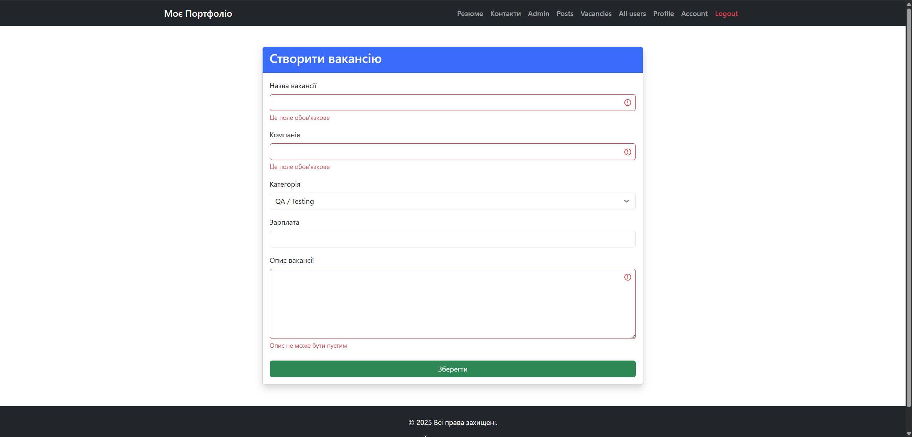
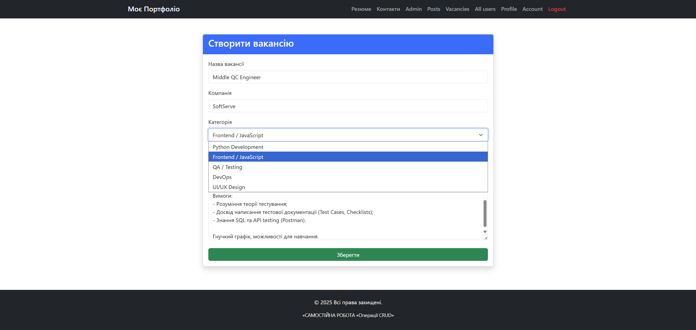
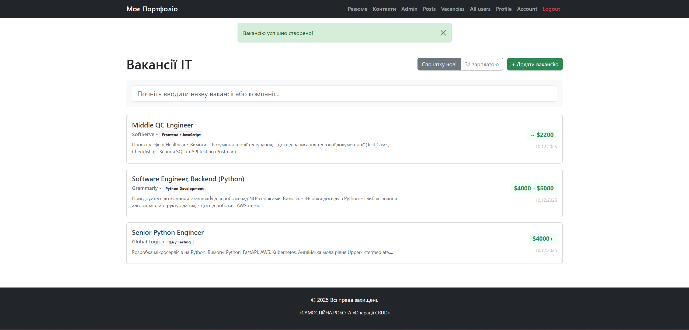
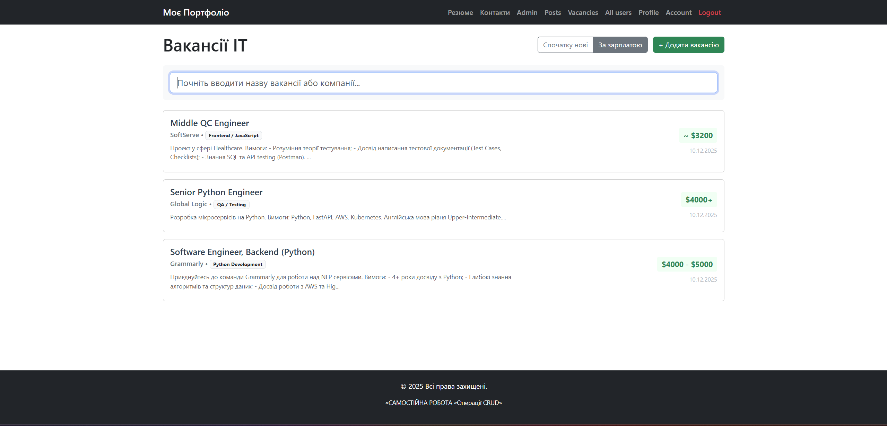
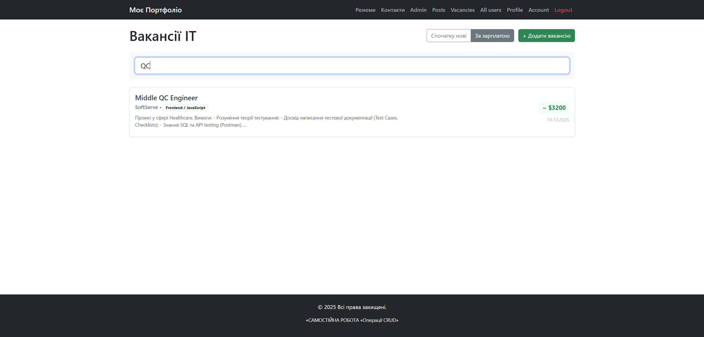
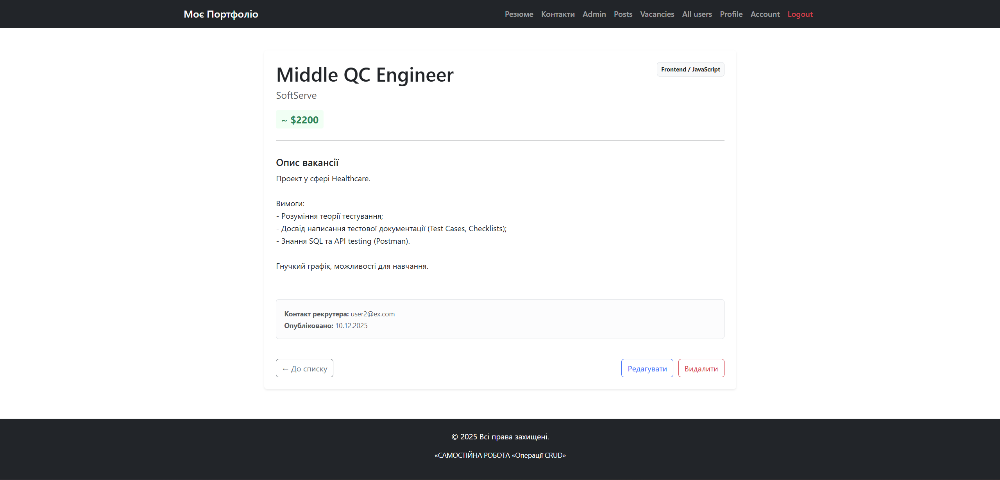
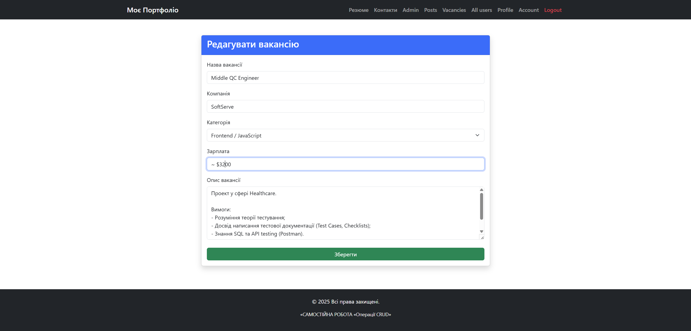
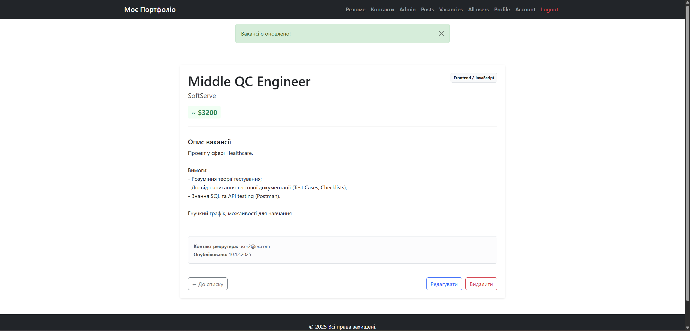
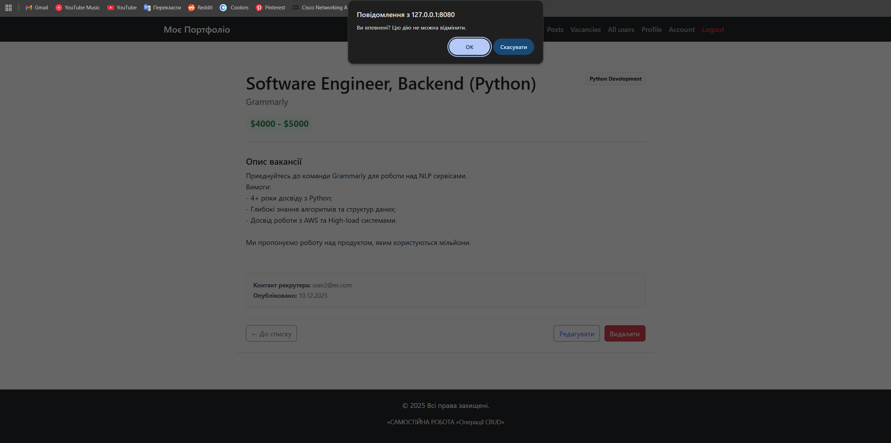
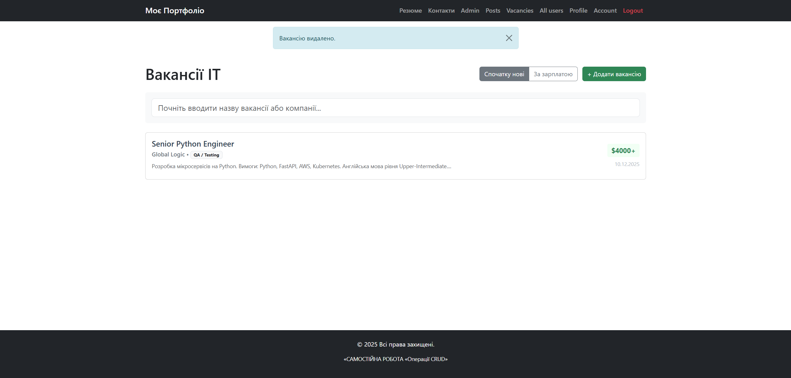

# Звіт про виконання Самостійної роботи «Операції CRUD»
**Тема:** Реалізація модуля "Вакансії ІТ" (Варіант №2).

### 1. Створення нової вакансії (помилка з пустими полями)

---

### 2. Створення нової вакансії

---

### 3. Головна сторінка зі списком вакансій (Сортування по даті)

---

### 4. Головна сторінка зі списком вакансій (Сортування по зарплаті)

---

### 5. Пошук по назві

---

### 6. Детальний перегляд вакансії

---

### 6. Редагування вакансії
Форма заповнюється існуючими даними. Якщо поле зарплати залишити пустим, автоматично підставляється "Не вказано".

---

### 7. Підтвердження видалення
Видалення реалізовано через форму з підтвердженням (JS confirm), щоб уникнути випадкових кліків.

