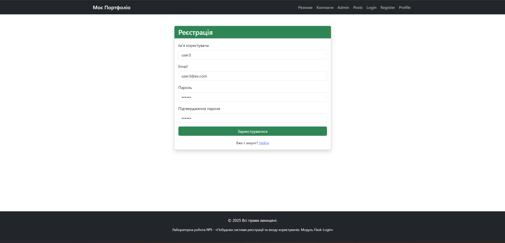
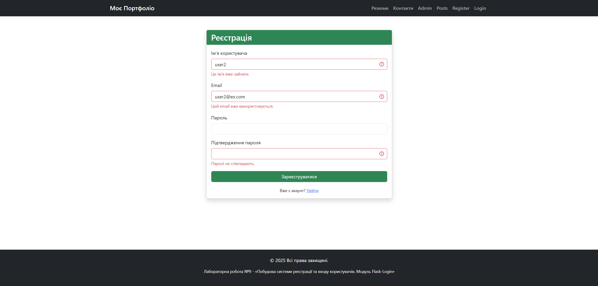
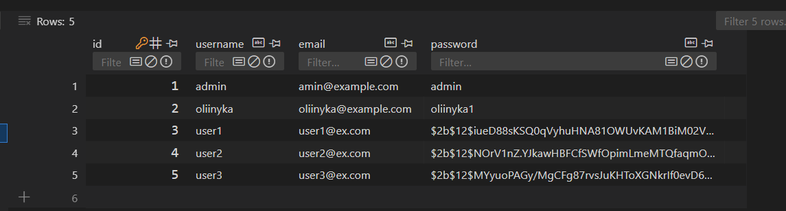
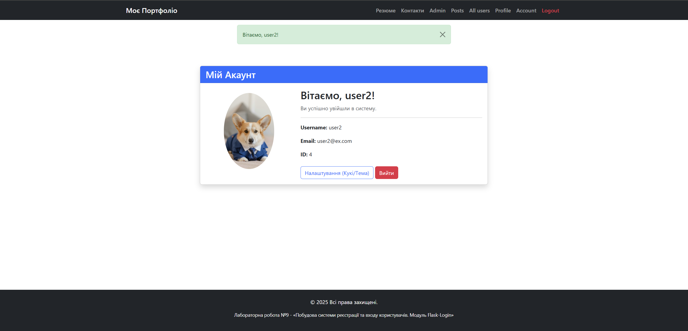
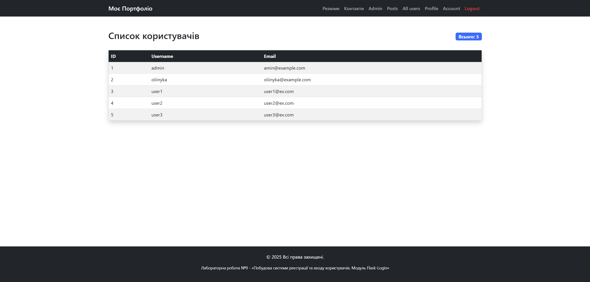

# Звіт про виконання Лабораторної роботи №9
**Тема:** Побудова системи реєстрації та входу користувачів. Модуль Flask-Login.

### 1. Реалізація реєстрації
Розроблено форму реєстрації нових користувачів.

Реалізовано валідацію даних: перевірка на співпадіння паролів та унікальність логіна/пошти (демонстрація обробки помилок).

---

### 2. Безпека даних (Хешування)
Паролі користувачів зберігаються у базі даних виключно у захешованому вигляді (використано `Flask-Bcrypt`).

---

### 3. Вхід в систему
Сторінка входу з відображенням Flash-повідомлення після успішної реєстрації.

---

### 4. Акаунт користувача
Персональна сторінка (`/account`), доступна тільки авторизованим користувачам. Відображає дані поточного сеансу та адаптивне меню (кнопка "Logout").

---

### 5. Список користувачів
Сторінка (`/users`), що виводить таблицю всіх зареєстрованих користувачів та їх загальну кількість. Доступ захищено декоратором `@login_required`.

---

### 6. Тестування
Результати виконання автоматичних тестів (`test_user_views.py`), що перевіряють реєстрацію, вхід, вихід та доступ до сторінок.
