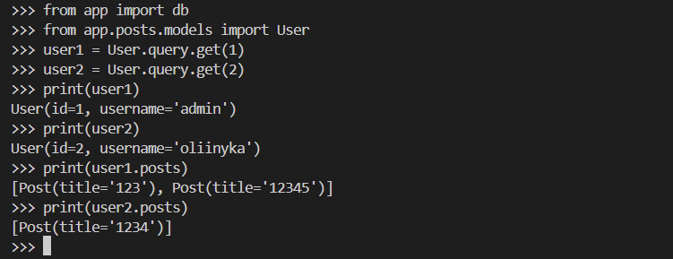
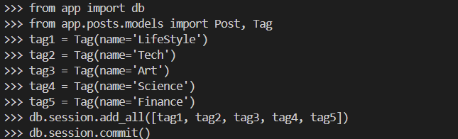
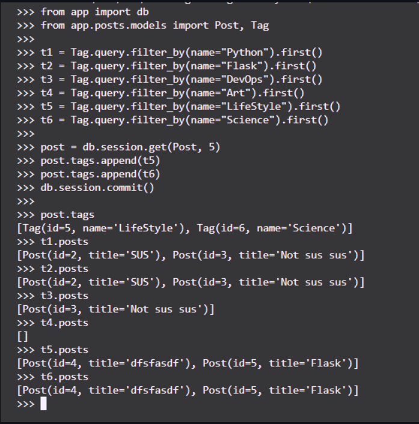
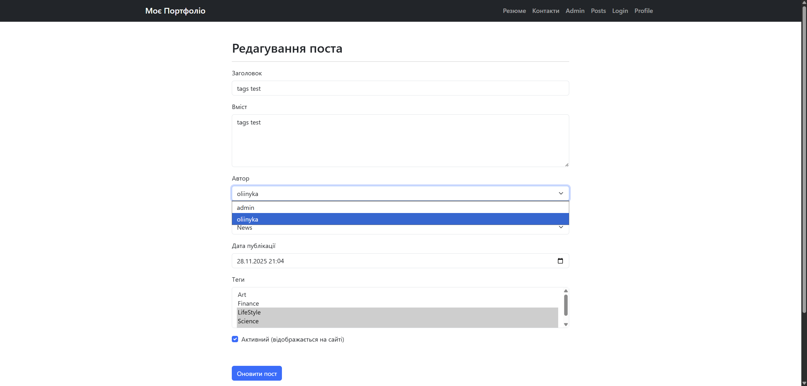
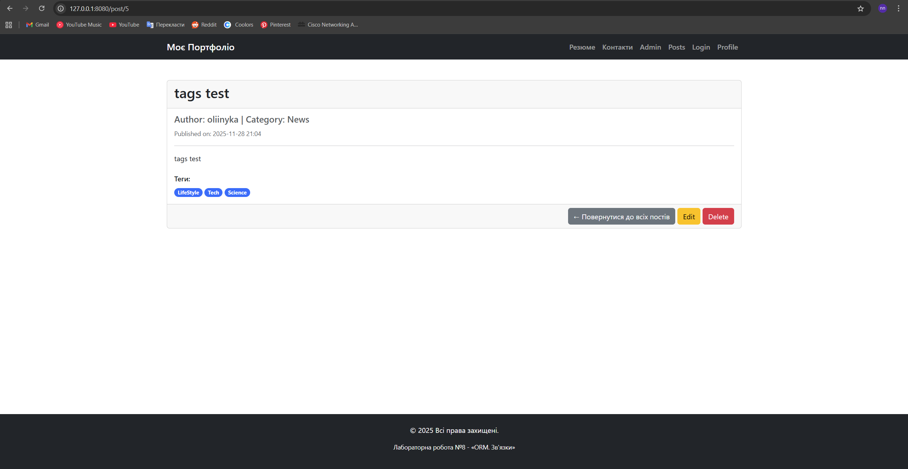

# Лабораторна робота №8: ORM. Зв'язки в SQLAlchemy

### 1. Зв'язок Один-до-Багатьох (User-Post)
Було створено модель користувача та встановлено зв'язок, де один користувач може мати багато постів.

*Крок 7: Вивід постів для користувачів user1 та user2 через user.posts*

---

### 2. Зв'язок Багато-до-Багатьох (Post-Tag)
Додано можливість позначати пости тегами.

**Додавання тегів у базу даних:**

*Крок 10 (частина 1): Створення тегів LifeStyle, Tech, Art, Science, Finance*

**Прив'язка тегів до постів та перевірка:**

*Крок 10 (частина 2): Прив'язка тегів до поста та перевірка двостороннього зв'язку (post.tags та tag.posts)*

---

### 3. Оновлення Інтерфейсу

**Форма створення/редагування поста:**
Реалізовано вибір автора (SelectField) та множинний вибір тегів (SelectMultipleField).

*Крок 8 та 11: Оновлена форма з вибором автора та тегів*

**Сторінка детального перегляду поста:**
Додано відображення тегів для поста.

*Крок 12: Фінальний вигляд сторінки*