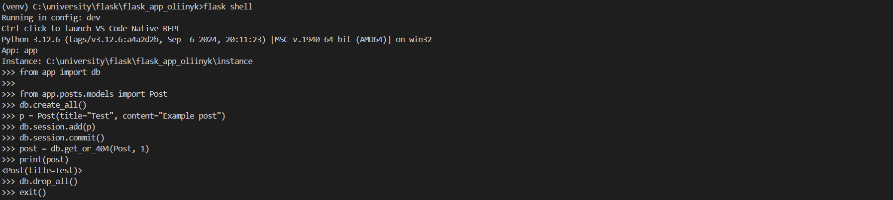
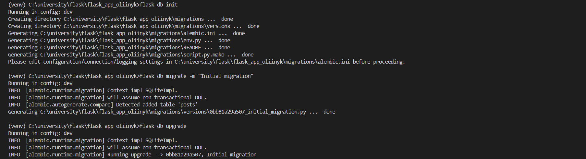
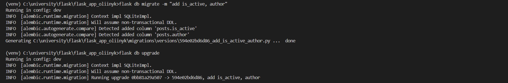
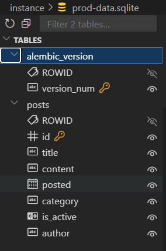
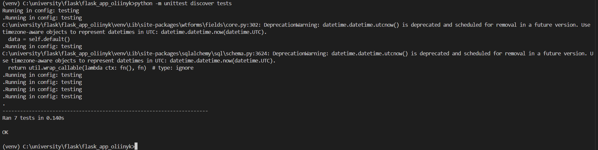
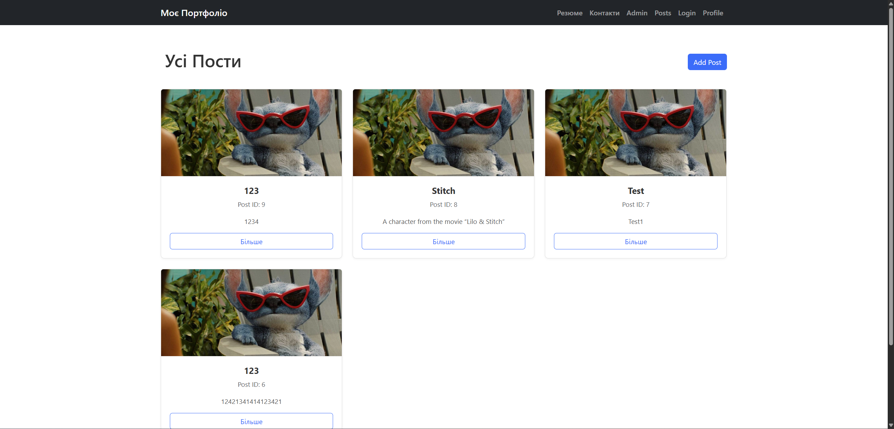
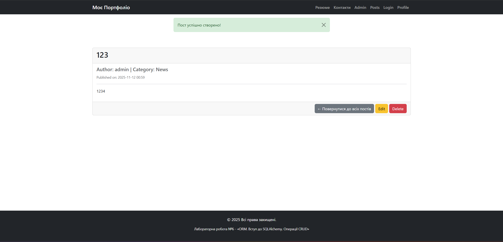
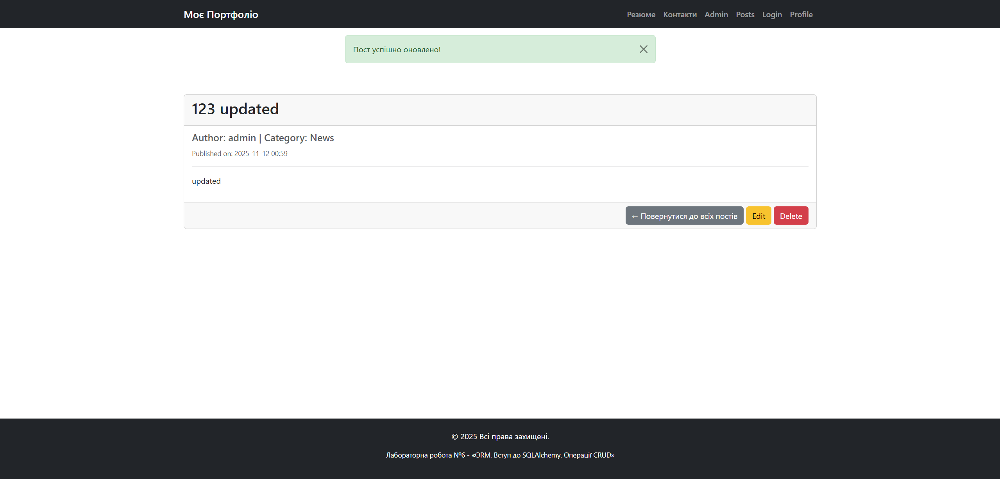
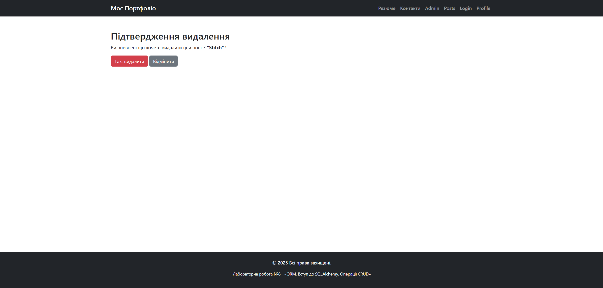
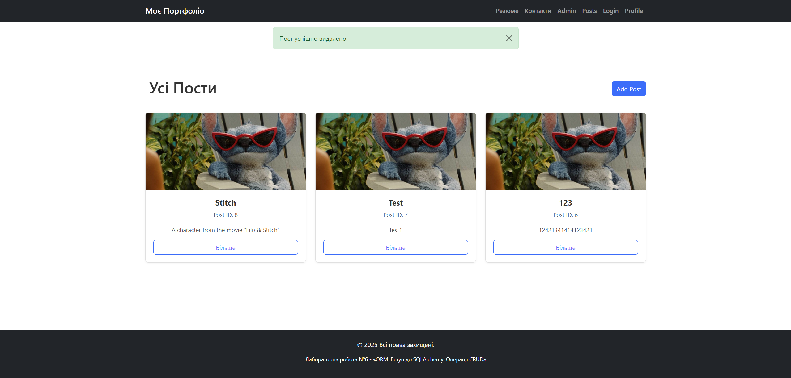

*Створення бази даних через фласк оболонку*

*Ініціалізація міграції і бази даних*

*Міграція (добавлено два нових поля)*

 
*База даних після міграції*

*Успішне проходження тестів*

*Сторінка всіх постів*

*Повідомлення про створення поста*

*Сторінка одного поста після оновлення*

*Сторінка підтвердження видалення*

*Повідомлення про видалення*
